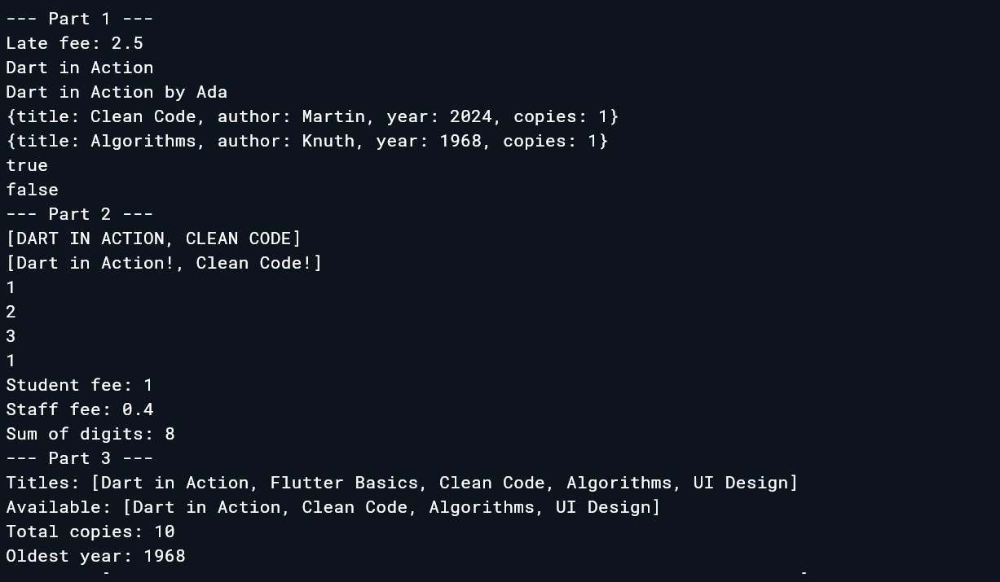
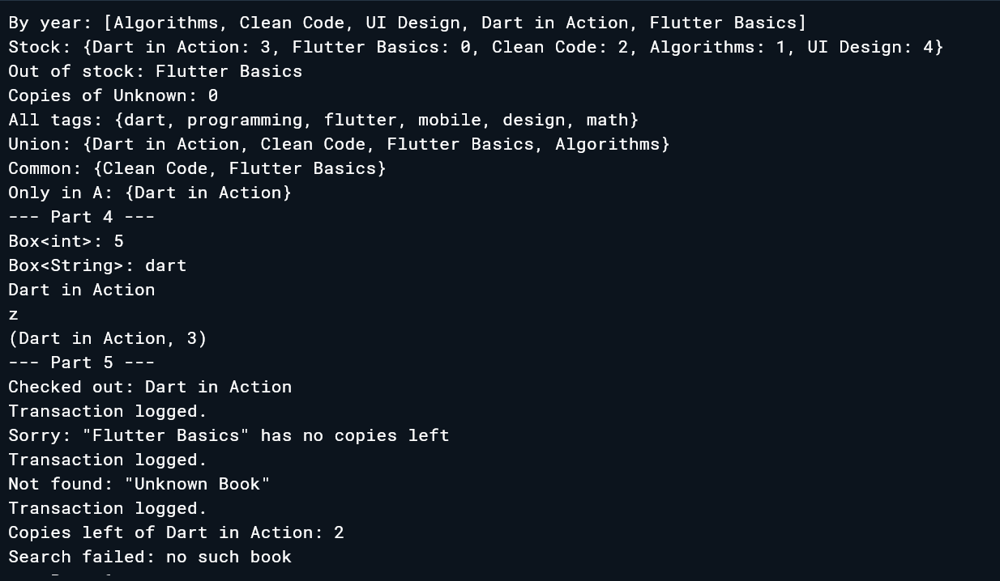
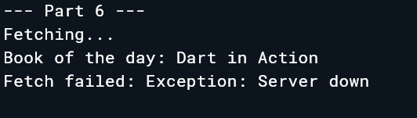

# CS 442 - Mobile Application Development
## Week 1 Lab Task: Enhanced Counter App

**Name:** Hamza Khan Tariq
**Roll Number:** 04072313050

---

## Personal Parameters
- **myThreshold:** 10 (sum of last 3 digits of roll number: 0+5+0 = 5, plus 5 = 10)
- **mySeedColor:** Colors.teal (first letter of last name that matches a Flutter color: Tariq → T → Teal)

---

## Screenshot


---

## Tasks Completed
- [x] Reset button added with Icons.refresh
- [x] Threshold message "You're on a roll!" appears when counter exceeds 10
- [x] Reset tracker displays how many times reset was pressed
- [x] Theme color changed to Colors.teal
- [x] About line added with name and roll number

---

## Reflection — What does setState() do?

Flutter builds the screen once and then stops watching my variables. So when a variable changes like the counter change, Flutter then has no idea about it and the screen stays the same. setState() is how I tell Flutter that something has changed and it needs to buil the screen again. Without calling setState(), the variable updates in memory but nothing actually changes visually....the app looks frozen even though the value is different under it.

---

*Built by Hamza Khan Tariq · 04072313050*


# Lab Task 2 — Course Roster Console App

**Name:** Hamza Khan Tariq
**Course:** CS442 - Mobile Application Development
**Date:** September 21, 2026

## About
A Dart console app built as part of Lab Task 2, exercising core Dart fundamentals from Session 1.

## Parts Completed
- ✅ Part 1 — Setup & Welcome
- ✅ Part 2 — Course & Roster Data
- ✅ Part 3 — Null-Safe Instructor Info
- ✅ Part 4 — Formatting Strings
- ✅ Part 5 — Operators in Action
- ✅ Part 6 — Enrollment Logic
- ✅ Part 7 — Reports & Loops
- ✅ Part 8 — Stretch Goals (CLI args, dart format, dart analyze)

## How to Run
```
dart run main.dart
```


# Week 3 Lab — Library Desk Assistant

**Name:** Hamza Khan Tariq
**Roll Number:** 04072313050
**Course:** CS442 - Mobile Application Development
**Date:** September 28, 2026

## About
A pure Dart console program for a small campus library desk. It practises functions, closures, collections, generics, error handling and async code on one shared book dataset. No Flutter UI.

## Parts Completed
- ✅ Part 1 — Functions & Parameters (positional, optional, named, default, arrow)
- ✅ Part 2 — Closures, Higher-Order Functions & Recursion
- ✅ Part 3 — Collections: List, Map & Set
- ✅ Part 4 — Generics (`Box<T>`, `firstOr<T>`, `Pair<A, B>`)
- ✅ Part 5 — Error Handling & Custom Exceptions
- ✅ Part 6 — Future & async/await

## Screenshots

**Parts 1–3**



**Parts 3–5**



**Part 6**



## How to Run
```
dart run Week3.dart
```
Or paste `Week3.dart` into [DartPad](https://dartpad.dev) and press Run.